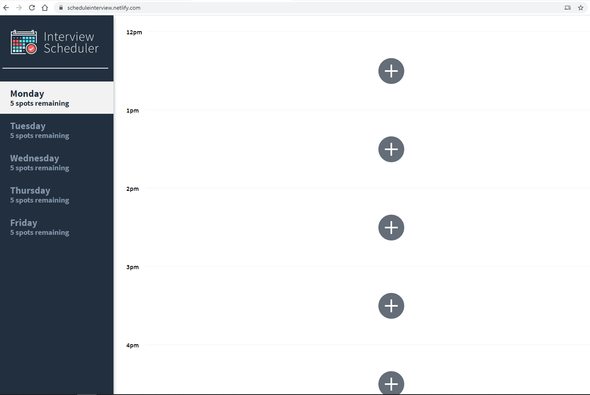
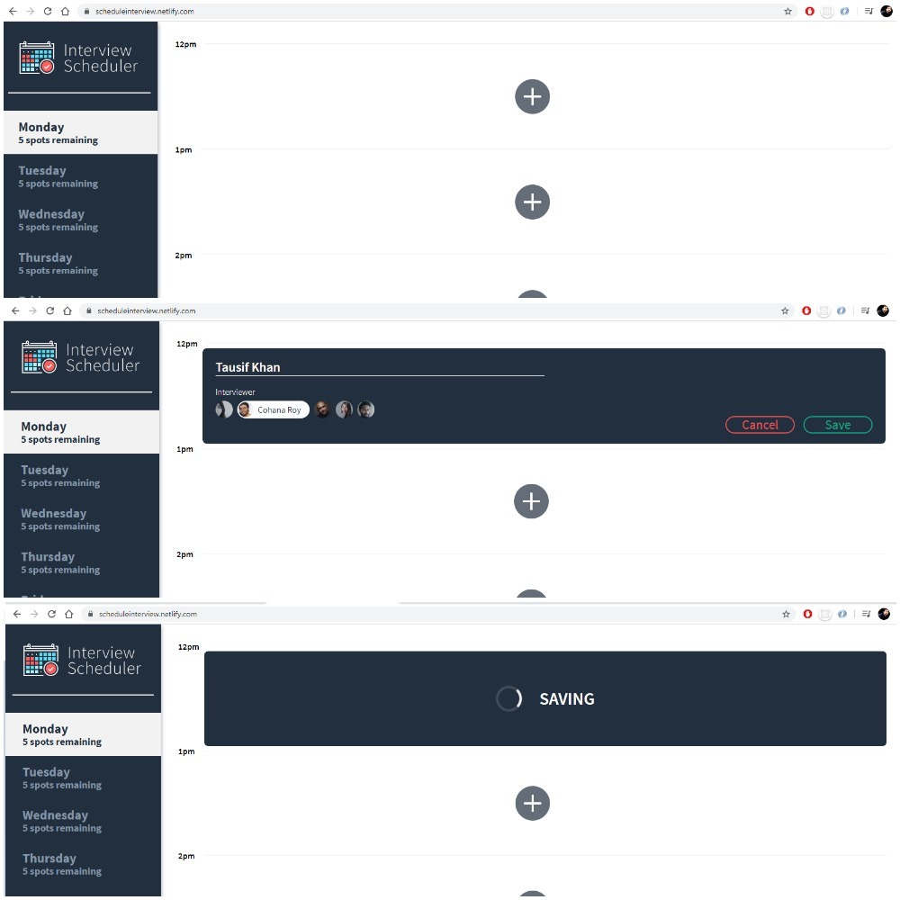
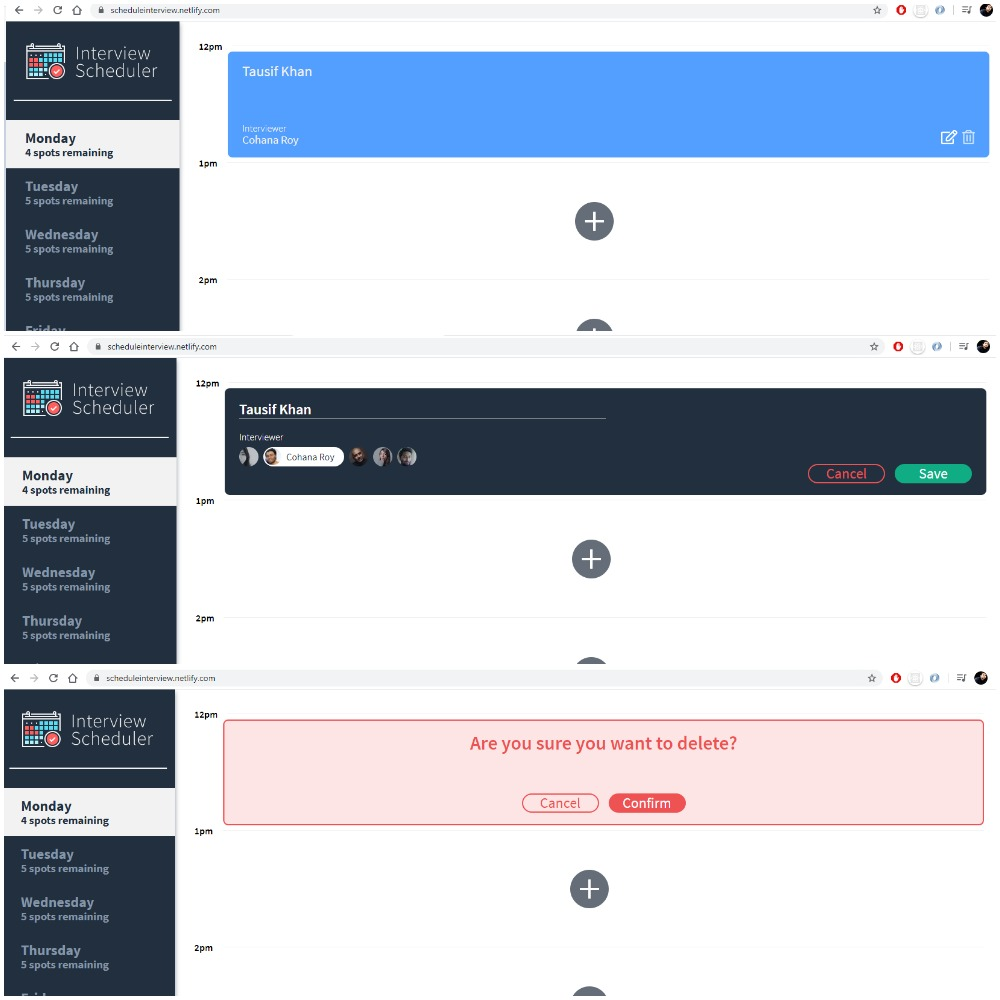
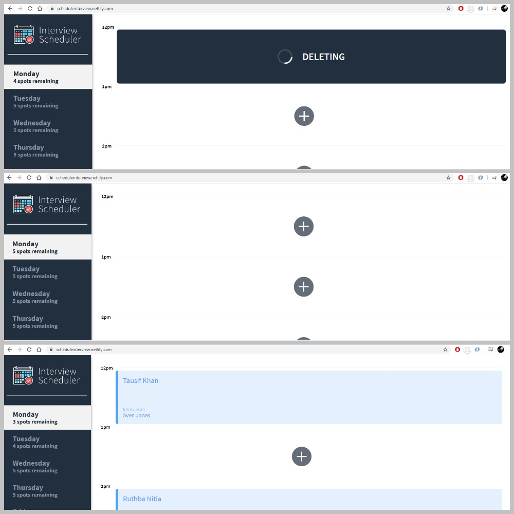

# Interview Scheduler
A single page REACT based web application that lets the user book an interview with a set of given Interviewers served from an API being hosted at https://scheduleinterview.herokuapp.com/api/interviewers. The API also contains a list of days from Monday to Friday and time slots between 12pm to 5pm.

The app is capable of doing the following things:
- User can book an interview between Monday and Friday.
- User can switch between weekdays.
- Book an interview in an empty slot.
- User can book an interview by typing in a name and clicking on an interviewer from a list of available interviewers.
- User can edit and delete an interview.
- Save or delete an ionterview to the database that is being served on the Heroku site.
- User is presented with a confirmation when they attempt to delete an interview.
- User is shown an error if an interview cannot be saved or deleted.
- User is shown a status indicator while asynchronous operations are in progress, i.e- Saving or Deleting.
- Decrease the number of slots available when an interview is booked.
- Increase the number of slots available when an interview is cancelled.
- The application makes API requests to load and persist data to the API hosted at Heroku.
- Update the GUI for other users REAL TIME on the number of slots and time range available to book an interview.   

## Link to the deployed Application

https://scheduleinterview.netlify.com/ 

## Technical Specifications

- Front-End: REACT, Axios, WebSockets
- Back-End: Node, Express
- Complier: Babel, Webpack Dev Server
- Testing: Jest, Storybook, Testing Library

## Setup

Install dependencies with `npm install`.

## User Experience Screenshots







## Running Webpack Development Server

```sh
npm start
```

## Running Jest Test Framework

```sh
npm test
```

## Running Storybook Visual Testbed

```sh
npm run storybook
```
